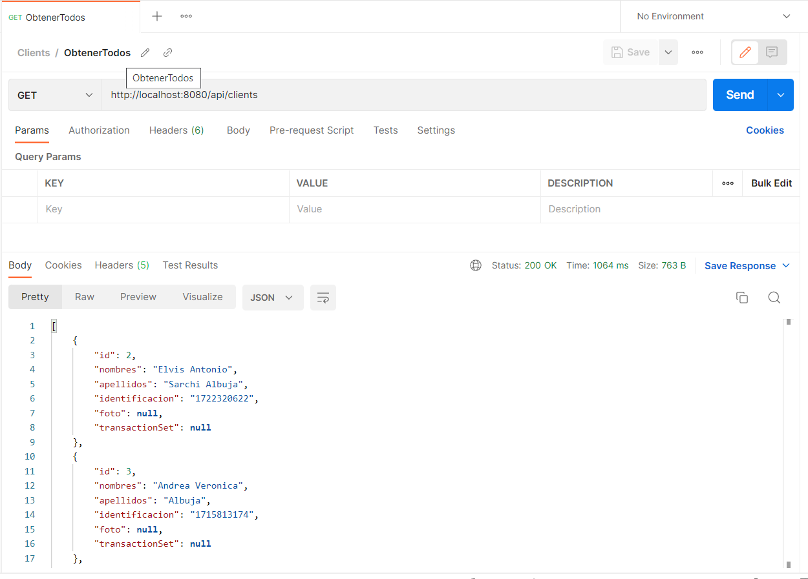

# APP INVENTARIOS

El objetivo de esta aplicación es la gestión del inventario
para el control de esxistencia de stock de productos, el registro de
transacciones y de clientes mediante el uso de SpringBoot, Java y MySql.

### Prequisitos
- Java 8
- SpringBoot 2.7.0
- Maven
- MySQL WorkBench
- Postman
  
### Dependencias
- Spring Web
- MySQL Driver

Para el desarrollo de la aplicación de gestión de inventario se ha levantado una base de datos con el motor de MySQL
el cual consta de las siguientes tablas:
- producto
- cliente
- tienda
- transaccion
- tienda_producto


La estructura de los paquetes de los archivo fuente de la aplicacion son los siguientes:

```
main
|__java
|___com
|____aalbuja 
|_____inventario
|______bean
|______controller
|______dao
|______handler
|______model
|______repository
|______service
test
|__java
|___com
|____aalbuja 
|_____inventario

````

Para probar los servicios que han sido levantados han creado mediante Postman en donde se describen los
servicios creados para las diferentes entidades de producto, tienda, pedido, cliente.


En la ejecucion del servicio se verifica la funcionalidad incorporada, ejm: obtencion de todos los clientes.



Ademas, mediante Postman en MockServer se simula el consumo de este servicio mediante el siguiente link [Mock Clientes](https://4292807a-9176-4dcc-86b2-d8f83278a355.mock.pstmn.io/clients).


Para finalizar en la aplicacion se han incluido las pruebas unitarias y de integracion para validar su funcionalidad.
